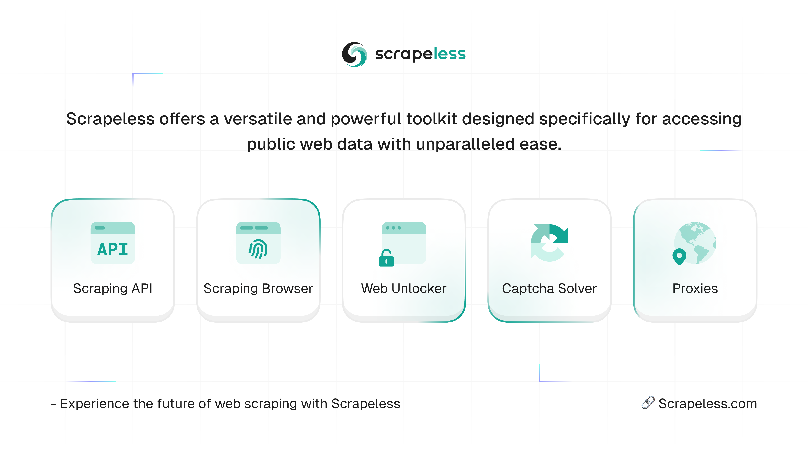

# scrapeless.com 😊

<picture>
  <source media="(prefers-color-scheme: dark)" srcset="images/scrapeless-dark.png">
  <source media="(prefers-color-scheme: light)" srcset="images/scrapeless-light.png">
  
</picture>
<h4 align="center">
  <b><a href="https://app.scrapeless.com/passport/login?utm_source=github&utm_medium=banner&utm_campaign=official">Get Started</a></b>
  •
  <a href="https://docs.scrapeless.com/en/overview/?utm_source=github&utm_medium=banner&utm_campaign=official">Docs</a>
  •
  <a href="https://discord.com/invite/xBcTfGPjCQ">Community</a>
  •
  <a href="https://www.scrapeless.com/en/?utm_source=github&utm_medium=banner&utm_campaign=official?utm_source=github&utm_medium=banner&utm_campaign=official">Official Website</a>
  •
  <a href="https://apidocs.scrapeless.com/">API Reference</a>
  </h4>

Scrapeless.com offers an enterprise-grade, AI-driven web scraping toolkit designed to help businesses efficiently access public web data. With years of expertise, we integrate advanced AI technologies to solve challenges like selecting high-quality proxies, optimizing headless browser configurations, and bypassing complex CAPTCHAs. Our solutions ensure seamless data extraction in dynamic environments, enhancing efficiency and adaptability. Additionally, we provide customized automated data collection services tailored to enterprise needs, enabling businesses to scale and gain a competitive edge in the data-driven landscape.

## Why choose Scrapeless

- Scraping Browser: Powerful cloud browser with stealth mode to bypass restrictions. Supports high concurrency, automation, and bulk scraping. Enables Scrape, Crawl, and Extract.
- Universal Scraping API: Bypass CAPTCHAs, IP blocks, and dynamic content in real time, ensuring uninterrupted access.
- Scraping API: Effortless and highly customizable data extraction with a single API call, providing structured data from any website.
- Deep SerpApi: Focused on SERP data scraping — effortlessly extracts real-time information. 1–2 second response time & only $1.5 per 1,000 requests.
- Proxies: Use high-quality, rotating proxies to scrape top platforms, with global coverage in 195+ countries.
- Enterprise-Grade: Custom solutions for large-scale and complex data needs.
- Free Trial: Try before you buy-experience our service firsthand.
- Pay-Per-Use: Flexible, cost-effective pricing with no long-term commitments.
- Easy Integration: Seamlessly integrate with your existing tools and workflows for hassle-free automation.

### [Scraping Browser](https://www.scrapeless.com/en/product/scraping-browser) Use Cases

- Unlimited concurrency: Instantly scale from 50 to 1000+ browser instances per task without server resource limits.
- Ultra cost-efficient: Overall cost is only 20%–60% compared to competitors.
- Real-time handling of reCAPTCHA, Cloudflare Turnstile/Challenge, AWS WAF, DataDome, and more.
- JavaScript-Intensive Websites: Perfect for sites relying heavily on JavaScript for content rendering.
- Dynamic content handling: Accurately simulates human behavior and captures interactive elements such as drop-down menus, forms or infinite scrolling.
- Natively compatible with Puppeteer and Playwright—integrate with existing scraping systems in a single line of code.

### [Universal Scraping API](https://www.scrapeless.com/en/product/universal-scraping-api) Use Cases

- High-Frequency Data Extraction: Frequent website visits for real-time data, such as financial market updates or news.
- Complex Website Access: Handles challenges like CAPTCHAs, Antibots, JavaScript rendering, or dynamic content.
- Bypassing Access Restrictions: Overcomes IP bans and restrictions on scraping-sensitive websites.
- Rapid Adaptation to Changes: Quickly adjusts to frequent changes in anti-scraping measures.

### [Scraping API](https://www.scrapeless.com/en/product/scraping-api) Use Cases

- Structured Data Access: Ideal for datasets like product listings or user reviews in a structured format.
- High Efficiency and Accuracy: Precise data extraction without dealing with unstructured content.
- Integration with Existing Systems: Seamless integration with software or databases for automated workflows.
- Reduced Development Time: Avoid custom scraping development; the API handles complexity.

### [Deep SerpApi](https://www.scrapeless.com/en/product/deep-serp-api) Use Cases

- Covers data from Google Search, Google Trends, etc., customized for different use cases.
- Average response time of just 1–2 seconds, ensuring fast and efficient data retrieval.
- Compatible with popular programming languages and tools such as Python, Node.js, and Golang for easy integration.
- Built-in advanced anti-detection techniques ensure stable scraping and large-scale, high-concurrency operations.
- Purpose-built for LLMs, RAG and [MCP](https://github.com/scrapeless-ai/scrapeless-mcp-server), delivering real-time and accurate search results.

### [Proxies](https://www.scrapeless.com/en/product/proxies) Use Cases

- Access 70M+ reliable residential and IPv6 IPs with HTTPS and SOCKS5 support, spanning 195+ countries. Use high-quality, rotating proxies to scrape top platforms while maintaining anonymity and avoiding IP bans.
- Effortlessly bypass geo-restrictions and ensure seamless global data extraction.

## Join the Community

- [Discord](https://backend.scrapeless.com/app/api/v1/public/links/discord)
- [Twitter](https://backend.scrapeless.com/app/api/v1/public/links/twitter)
- [YouTube](https://backend.scrapeless.com/app/api/v1/public/links/youtube)
- [Linkedln](https://backend.scrapeless.com/app/api/v1/public/links/linkedin)
